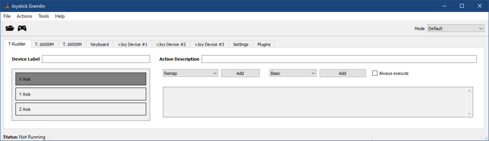
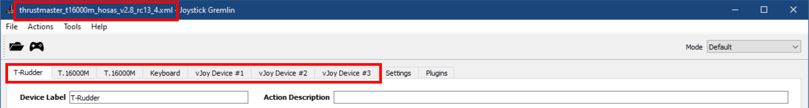
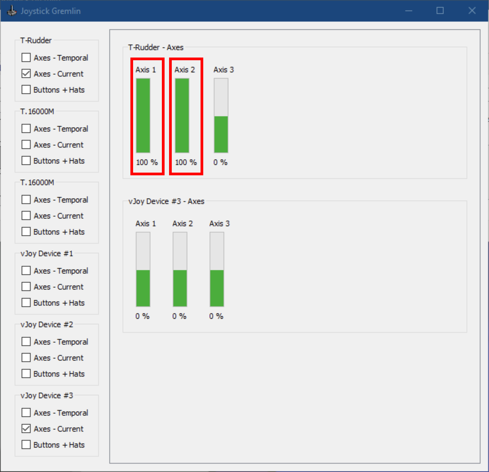

# :joystick: TUTORIEL :joystick: How to merge joystick axes in Joystick Gremlin `RC13.4.2+`

🇫🇷 La version française du tutoriel est disponible [ici](https://github.com/Drakehinst/JoystickGremlin/blob/rc13.4/tutorials/tutorial_merge_axis_fr.md) ! 

:warning: **Warning!** :warning:

This tutorial is meant only for users of versions `RC13.4.2` and later. The `Merge Axis` function in version `RC13.4.1` didn't work properly with all peripherals and required a bugfix. Nevertheless, the old version of this tutorial is still available [at the following link](./tutorial_merge_axis_rc13.4.1_fr.md) if case you need it (in French only at the moment).

## Step 1

1. Download the archive `joystick_gremlin_rc13.4.x.zip` for version `RC13.4.2` or later of Joystick Gremlin in [the Releases page](https://github.com/Drakehinst/JoystickGremlin/releases).
1. Extract the archive in any folder.
1. Start `joystick_gremlin.exe` from the main folder.

## Step 2

In the menu `Help / About`, check that the version of Joystick Gremlin you're running is *"Release Candidate 13.4.2"* or later.

## Step 3

Load your usual profile then check that all your peripherals are detected (joysticks, pedals, rudder, keyboard, vJoys, etc.).

## Step 4

Delete all `Remap` type actions for both axes you want to merge (here *"T-Rudder - X Axis"* and *"T-Rudder - Y Axis"*). For example, in the profile below, no action is associated to neither axis.

:warning: **Warning!** :warning:

Depending on configurations, the `Response Curve` action types may prevent the correct axes fusion calculation by the `Merge Axis` function. If you do not obtain the desired result at the end of this tutorial, please also delete those `Response Curve` actions associated to either of the physical axes you want to merged, and instead reconfigure one single `Response Curve` in the corresponding vJoy tab for the output axis you will have selected after in the `Merge Axis` configuration. 😉

## Step 5

Configure the "Merge Axis" as shown in the example below:
1. Open the `Action / Merge Axis` menu.
1. Click on `New Axis`.
1. The *"Lower Half"* axis corresponds to the backward/negative movement (for example the left pedal).
1. The *"Upper Half"* axis corresponds to the forward/positive movement (for example the right pedal).
1. Select an output vJoy axis.
1. Select the `Average` merging operation (a sort of mean calculation of both pedals, particularly adapted to merging the backward/forward movements).
1. **DO NOT** yet modify the *"Initial value"* fields, as those are covered in [step 8](../tutorials/tutorial_merge_axis_en.md#step-8).

## Step 6

1. Close the `Merge Axis` window.
1. Open the `Tools / Input Viewer` tool.
1. Check both physical peripherals whose axes you previously merged in [step 5](../tutorials/tutorial_merge_axis_en.md#step-5) (here, `T-Rudder / Axes - Current`, *"Axis 1"* and *"Axis 2"*, that is, axes X and Y), to show their respective real-time value plots.

## Step 7

1. Press each physical axes as far as it will go (here, the left and right pedals of the *"T-Rudder"*, that is axes X and Y, or *"Axis 1"* and *"Axis 2"*)
1. Completely release both axes.
1. Note down their values at rest and divide them each by 100 (for example: `100%` :arrow_right: `1.00`, `-100%` :arrow_right: `-1.00`, `0%` :arrow_right: `0.00`, `50%` :arrow_right: `0.50`).

## Step 8

1. Minimize the `Input Viewer` window (we'll get back to it for the final test).
1. Open the `Merge Axis` window again.
1. Enter each *"Initial value"* found in [step 7](../tutorials/tutorial_merge_axis_en.md#step-7) under the corresponding axes.
1. Close the `Merge Axis` window.

## Step 9

1. Save your profile (under another name if it was created with an earlier version of Joystick Gremlin, just by precaution).
1. Activate the profile.
1. Bring the `Input Viewer` window back up to make following verifications:
    1. Check the *"vJoy Device"* where the output axis of the `Merge Axis` is located, as configured in [step 5](../tutorials/tutorial_merge_axis_en.md#step-5) (here, `vJoy Device #1 / Axes - Current`, *"Axis1"*, that is axis X).
    1. Pressed the forward movement physical axis as far **as it will go** (for example, the right pedal).
    1. Check that the value of the vJoy axis goes from `0%` to `100%` **(and not from `0%` to `50%`)**.
    1. While keeping the first axis firmly pressed, press the backward movement physical axis **as far as it will go** (for example, the left pedal).
    1. Check that the value of the vJoy axis goes from `100%` to `0%` **(and doesn't suddenly jump from `50%` à `100%`, before decreasing to `0%`, otherwise you will have to check your configuration again from [step 5](../tutorials/tutorial_merge_axis_en.md#step-5))**.
    1. **Completely** release the forward movement physical axis.
    1. Check that the value of the vJoy axis goes from `0%` to `-100%`.
    
**:rocket: IF everything is working as intended, you're done with the configuration! 😄**

---

:warning: **Warning!** :warning:

**From now on, don't forget to always start the Joystick Gremlin version you have downloaded and extracted at [step 1](../tutorials/tutorial_merge_axis_en.md#step-1)!**

[The official version 13](https://github.com/WhiteMagic/JoystickGremlin/releases) is not longer developed by @WhiteMagic, the creator of Joystick Gremlin, who is now fully committed to [developing version 14](https://github.com/WhiteMagic/JoystickGremlin/tree/develop).

So, when in doubt, update your shortcut to redirect them to the version downloaded in this tutorial.

**The profile you saved in this version is 100% retro-compatible with the official version `13.3` of Joystick Gremlin, though the `Merge Axis` will have the disruptive behavior described in [step 9](../tutorials/tutorial_merge_axis_en.md#step-9) if you use it instead of my patched version. 😉**
