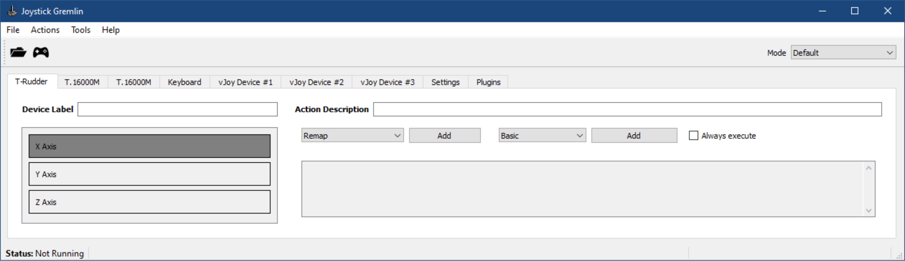
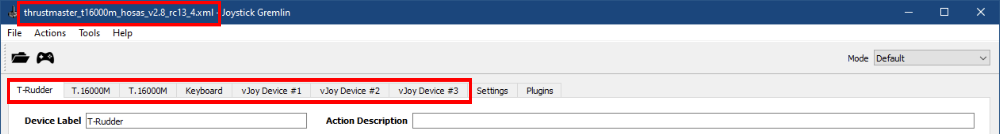
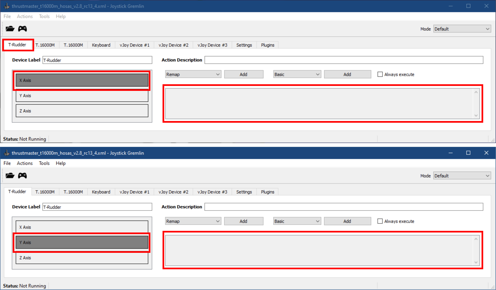
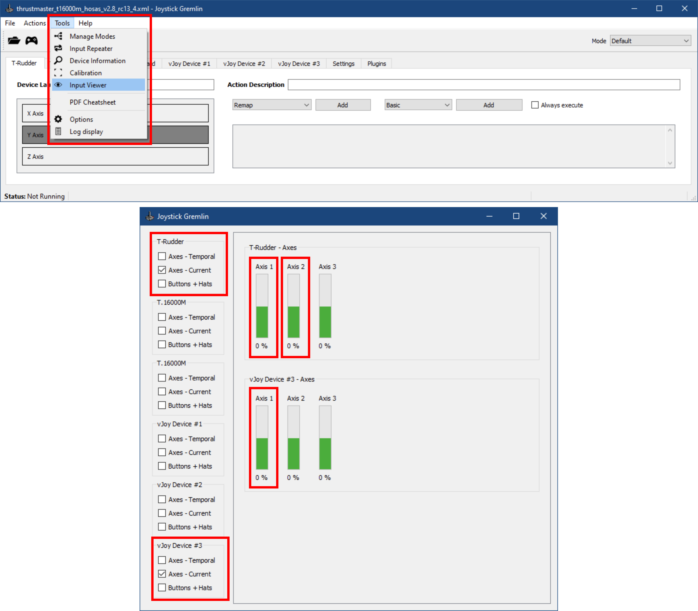
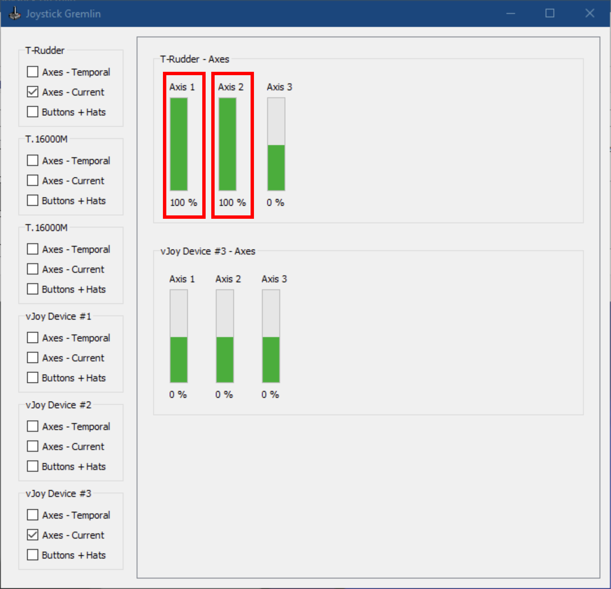

# :joystick: TUTORIEL :joystick: Comment fusionner vos axes de joysticks sur Joystick Gremlin RC13.4

## Étape 1

1. Téléchargez l'archive `joystick_gremlin_rc13.4.x.zip` de la dernière version de Joystick Gremlin depuis [la page des Releases](https://github.com/Drakehinst/JoystickGremlin/releases).
1. Extrayez l'archive dans le dossier de votre choix.
1. Lancez `joystick_gremlin.exe` depuis le dossier principal.

## Étape 2

Vérifiez que la version de Joystick Gremlin est bien *"Release Candidate 13.4.1"* ou une version ultérieure dans le menu `Help / About`.

## Étape 3

Chargez votre profil habituel puis vérifiez que tous vos périphériques sont détectés (joysticks, pédaliers, palonniers, clavier, vJoys, etc.).

## Étape 4

Supprimez toutes les actions `Remap` sur les deux axes à fusionner (ici *"T-Rudder - X Axis"* et *"T-Rudder - Y Axis"*). Par exemple, dans le profil ci-dessous, aucune action n'est associée à chacun des deux axes.

:warning: **Attention!** :warning:

Selon leur configuration, les actions `Response Curve` peuvent fausser la fusion des axes. Si vous ne parvenez pas au résultat attendu à la fin de ce tutoriel, supprimez-les également à cette étape, quitte à les reconfigurer correctement plus tard. ;)

## Étape 5

Configurez le "Merge Axis" comme dans l'exemple ci-dessous:
1. Ouvrez le menu `Action / Merge Axis`.
1. Cliquez sur `New Axis`.
1. L'axe *"Lower Half"* correspond à l'axe de marche arrière (par exemple la pédale de gauche).
1. L'axe *"Upper Half"* correspond à l'axe de marche avant (par exemple la pédale de droite).
1. Sélectionnez un axe de vJoy.
1. Sélectionnez l'opération `Average`.

## Étape 6

1. Fermez la fenêtre de `Merge Axis`.
1. Ouvrez l'outil `Tools / Input Viewer`.
1. Activez la visualisation des deux axes.
fusionnés (ici `T-Rudder / Axes - Current`, *"Axis 1"* et *"Axis 2"*, c'est-à-dire les axes X et Y) et de l'axe vJoy ciblé à l'[étape 5](../tutorials/tutorial_merge_axis_fr.md#étape-5) (ici `vJoy Device #1 / Axes - Current`, *"Axis1"*, c'est-à-dire l'axe X).

## Étape 7

1. Appuyez à fond sur chacun des deux axes (ici la pédale de gauche et la pédale de droite du *"T-Rudder"*, c'est-à-dire les axes X et Y, ou *"Axis 1"* et *"Axis 2"*)
1. Relâchez complètement les deux axes.
1. Notez la valeur de chacun des deux axes au repos, et divisez-la par 100 (par exemple: `100%` :arrow_right: `1.00`, `-100%` :arrow_right: `-1.00`, `0%` :arrow_right: `0.00`, `50%` :arrow_right: `0.50`).

## Étape 8

1. Minimisez la fenêtre du `Input Viewer`.
1. Allez dans l'onglet `Settings` de la fenêtre principale.
1. Cherchez la catégorie "Initial Axis Values" correspondant à chacun des deux axes (ici *"T-Rudder - Initial Axis Values"*)
1. Entrez les valeurs trouvées à l'[étape 7](../tutorials/tutorial_merge_axis_fr.md#étape-7) dans les axes correspondants.

## Étape 9

1. Sauvegardez votre profil (sous un autre nom s'il avait été créé avec une version antérieure de Joystick Gremlin, par sécurité).
1. Activez le profil.
1. Revenez à la fenêtre du `Input Viewer` et effectuez les vérifications suivantes:
    1. Appuyez **à fond** sur l'axe de marche avant (par exemple la pédale de droite).
    2. Vérifiez que la valeur de l'axe du vJoy passe bien de `0%` à `100%` **(et non de `0%` à `50%`)**.
    3. Tout en maintenant le premier axe enfoncé, et appuyez **à fond** sur l'axe de marche arrière (par exemple la pédale de gauche).
    4. Vérifiez que la valeur de l'axe du vJoy passe bien de `100%` à `0%` **(et ne passe pas d'un coup de `50%` à `100%`, avant de diminuer jusqu'à `0%`)**.
    5. Relâchez **complètement** l'axe de marche avant.
    6. Vérifiez que la valeur de l'axe du vJoy passe bien de `0%` à `-100%`.
    
**:rocket: Si tout est fonctionnel, vous en avez terminé avec la configuration ! :)**

---

:warning: **Attention!** :warning:

**À partir de maintenant, n'oubliez pas de toujours utiliser la version de Joystick Gremlin que vous avez téléchargée à l'[étape 1](../tutorials/tutorial_merge_axis_fr.md#étape-1) !**

[La version 13 officielle](https://github.com/WhiteMagic/JoystickGremlin/releases) n'est plus développée par @WhiteMagic, le créateur de Joystick Gremlin, qui se consacre désormais au [développement de la version 14](https://github.com/WhiteMagic/JoystickGremlin/tree/develop).

En cas de doute, mettez à jour vos raccourcis pour les rediriger vers la version télechargée ici.

**Le profil que vous avez sauvegardé avec cette version est 100% rétro-compatible avec la version `13.3` officielle de Joystick Gremlin. ;)**